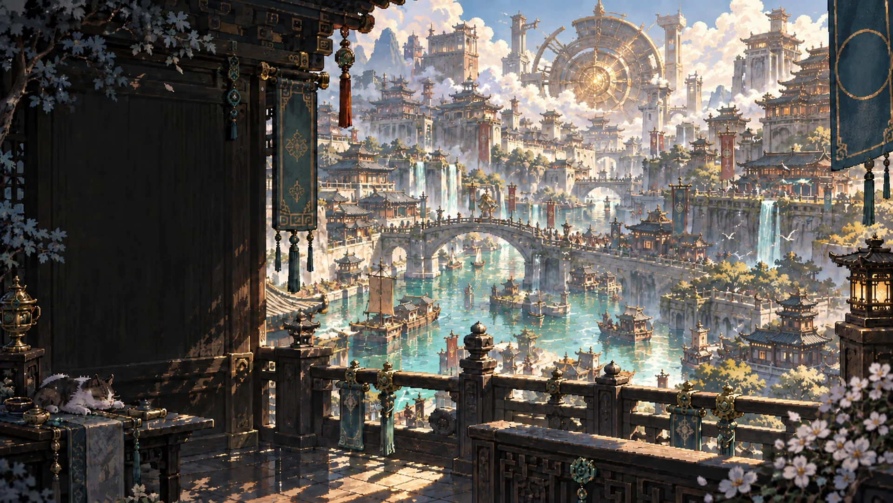

# Dicebound · 烬海天阙

**一款以东方幻想城市为背景的单人战棋 roguelike。** 从五位同行者中组成三人小队，在十二层分支旅途中学习招式、组合旧物，登上曜京天阙。

[English](README.md) · [项目主页](https://chenzhiyong1994.github.io/dicebound/) · [下载游玩](#play) · [构建游戏](#build) · [反馈问题](https://github.com/chenzhiyong1994/dicebound/issues)

这是基于可玩版本 **0.22.4** 的首个公开版本 **Beta 1**。游戏界面与剧情目前为**简体中文**，英文 README 仅为项目文档。



*游戏标题场景原画。*

## 玩法

- **三人协同，逐人行动。** 在队员之间自由切换，安排走位、攻击、支援与控制。结束行动只提交当前角色，全部存活队员结束后才轮到敌方。
- **让地形参与决策。** 掩体、高台、水雾、阴影、热管与可投掷物件影响站位和施术；可以查看敌方技能与下回合动向。
- **边攀登，边构筑。** 选择战斗、精英幕门、商店、营火和事件路线，学习及升级角色专属技能、收集旧物，也可花费金币重随商店技能。
- **五位不同的同行者。** 任选三人，每人拥有独立招式与奥义。

| 同行者 | 擅长 |
| --- | --- |
| 司玄 | 控制、制衡与护持 |
| 凌风 | 刀势、击退与余焰 |
| 沧泠 | 潮术、治疗与支援 |
| 晏烛影 | 借影换位与精准刺击 |
| 商朔 | 护盾、守势与反击 |

画面采用手绘场景、像素人物与墨玉界面，配合动态立绘、技能演出及分场景配乐。设置中可以开启「减少动态效果」。

<a id="play"></a>
## 开始游戏

**[下载 Windows x64 安装包 · Beta 1](https://github.com/chenzhiyong1994/dicebound/releases/download/v0.22.4-beta.1/Dicebound-0.22.4-beta.1-Windows-x64-Setup.exe)**

[免安装 ZIP](https://github.com/chenzhiyong1994/dicebound/releases/download/v0.22.4-beta.1/Dicebound-0.22.4-beta.1-Windows-x64.zip) · [SHA-256 校验值](https://github.com/chenzhiyong1994/dicebound/releases/download/v0.22.4-beta.1/SHA256SUMS.txt) · [版本说明](https://github.com/chenzhiyong1994/dicebound/releases/tag/v0.22.4-beta.1)

下载安装包后，按向导完成安装。使用免安装版时，完整解压 ZIP 再运行 `Dicebound.exe`；请保留同目录的数据文件夹、运行库和许可说明。两种方式都不需要安装 Unity 或开发环境。安装程序与游戏程序尚未进行代码签名，Windows 可能显示发布者或信誉提示；[下载与校验说明](manual/build.md#download)提供文件校验方法。

从标题开始新旅程，召集三人，再选择相连的路线节点。默认难度为**踏岚**，另外三档为**破障、逆潮、登阙**。

| 操作 | 用途 |
| --- | --- |
| 鼠标左键 | 选择队员、技能、路线或目标 |
| `F1`–`F3` | 切换当前队员 |
| `Space` | 确认已选择的行动 |
| 鼠标右键 / `Esc` | 取消当前选择或关闭面板 |
| `E` | 结束当前队员行动 |
| 按住 `Alt` | 临时查看人物下方的地面 |
| 滚轮 / 中键拖动 | 缩放 / 平移战场 |
| `Home` / `F11` | 恢复视角 / 切换全屏 |

先选择目标，再确认行动。蓝色表示可到达区域，金色表示预计移动路径。队伍详情与行囊可查看技能、当前状态和旧物；带下划线的词条可以点开查看规则。

游戏自动保存进度，设置中提供存档导入导出、音量和减动选项。尝试新 Beta 前建议备份存档；[开发说明](manual/build.md)包含存档位置。

<a id="build"></a>
## 构建

当前支持 **Windows x64**。使用 **Unity 6000.3.24f1（6.3 LTS）**、Windows Build Support 和 **PowerShell 7**。项目使用 **URP 17.3.0**，依赖版本由提交的 package manifest 与 lockfile 固定。

```powershell
git clone https://github.com/chenzhiyong1994/dicebound.git
cd dicebound
pwsh -NoProfile -File tools/build-native.ps1 -Editor "C:/path/to/6000.3.24f1/Editor/Unity.exe"
```

产物为 `native/Dicebound/Builds/Windows/Dicebound.exe`。也可以用对应版本的 Unity Editor 打开 `native/Dicebound`。首次导入需要联网获取 Unity 依赖；构建后的游戏不需要游戏账号或在线生成服务。

[完整构建说明与可选 .NET 10 规则检查](manual/build.md)

## 源码结构

| 路径 | 内容 |
| --- | --- |
| `native/Dicebound/Assets/Dicebound/Core/` | 战棋规则、内容与成长 |
| `native/Dicebound/Assets/Dicebound/Persistence/` | 旅程与纪事存档 |
| `native/Dicebound/Assets/Dicebound/Runtime/` | Unity 画面、输入、界面和音频 |
| `native/Dicebound/Assets/Resources/` | 游戏美术、音频、字体及运行资源 |
| `native/Dicebound/Assets/StreamingAssets/` | 本地视频 |
| `tools/` | 构建与开发工具 |
| `docs/` | 静态项目主页 |

## Beta 状态

这是早期公开 Beta。独立导出的公开项目已通过全新 Unity Windows 构建，没有 C# 或 Shader 编译错误。最终立绘与视频改动尚未完成新一轮实机视觉检查和完整回归，编译成功不能替代这部分验收。平衡、表现和兼容性仍可能调整。目前未提供 Linux、macOS、移动端或英文游戏版本。

部分动态立绘采用固定透明轮廓，配乐使用完整曲目，尚未制作按乐句衔接的无缝循环。具体范围见[更新记录](CHANGELOG.md)。

欢迎参与改进，请先阅读[贡献说明](CONTRIBUTING.md)。反馈问题时附上版本、复现步骤及必要日志，并移除私人信息。涉及敏感信息的问题按[安全说明](SECURITY.md)处理。

<a id="licenses"></a>
## 许可与鸣谢

原创代码及工具脚本采用 [MIT License](LICENSE)。**美术、世界与角色设定、视频、音乐、字体和第三方素材不自动适用 MIT。**具体范围及来源见 [ASSET_NOTICES.md](ASSET_NOTICES.md)。

项目使用 AI 辅助制作的插画和视频、维护者提供的 Suno 生成配乐，以及独立许可的字体与公共素材库。相关工具与素材作者不代表对本项目的认可。
